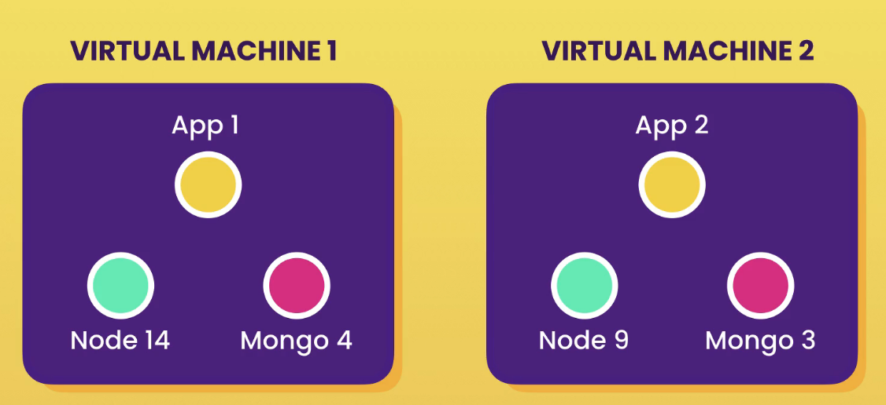
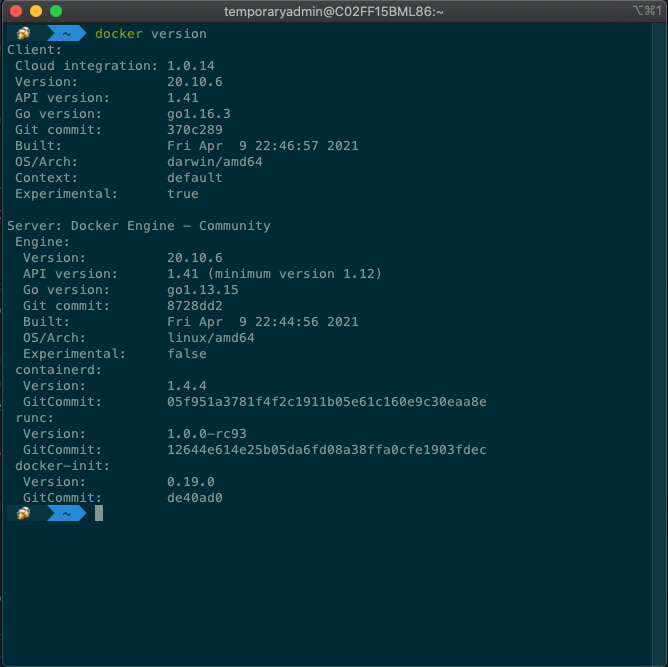
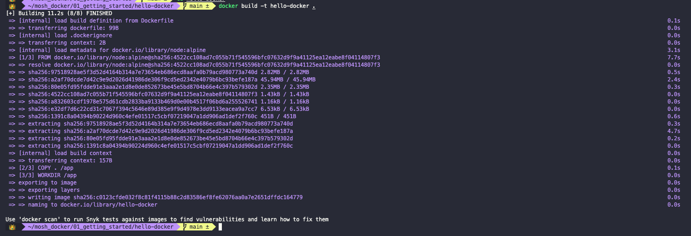

# Introduction to Docker

- [Introduction to Docker](#introduction-to-docker)
  - [What is Docker?](#what-is-docker)
  - [Virtual Machines Vs Containers](#virtual-machines-vs-containers)
  - [Docker architecture](#docker-architecture)
  - [Docker development workflow](#docker-development-workflow)

## What is Docker?

Docker is a platform for building, running and shipping applications in a consistent manner. With Docker, if the application works in your machine, it will work in production. Without Docker, this might not happen for three different reasons:

1. files are missing in the deployed version (the application is not fully deployed)
2. software versions mismatch
3. different configuration in different machines (like env variables)

What Docker does is to package the application with everything it needs to run. Therefore, if it works on the development machine, it will work on testing and production machines as well. Additionally, any new comers will not have to go through a complex local setup, but just use that Docker container.

Docker download and run dependencies in a container, which is an isolated environment that allows multiple applications use different versions of some software side by side.

  `docker-compose up`
  
Docker can also easily remove the dependencies associated with an application when it is not in use.

  `docker-compose down --rmi all`

You can run multiple Docker containers (for example, multiple applications) in you machine. Each Docker container will generate its needed environment and avoid clashes.

## Virtual Machines Vs Containers

A VM is an abstraction of a machine (from its physical hardware). We can run multiple VMs in a single physical machines using a special kind of program called a *hypervisor*. There are multiple hypervisors in the market: like VirtualBox, or VMware. Each VM can run its own software (even the OS).



Problems with VMs are that:

- each VM needs its own OS. Each copy of OS will need to be maintained, liscenced, patched and monitor.
- slow to start
- resource intensive (each VM takes up a slice of the actual hardware - CPU, RAM, Storage)

A container is an isolated environment for running an application (Allow running multiple apps in isolation), just as a VM. Differences are that:

- they all share the OS of the host and are therefore, more lightweight.
- containers start up very quickly.
- they need less hardware resources (no need to assign CPU cores or memory space).

## Docker architecture

Docker uses a client-server architecture which communicate using a REST API. The server is called the **Docker Engine**. It sits on the background and takes care of building and running containers. Technically, a container is a process like any other one running in your computer (The container is technically a special process that runs on the computer. All containers share the kernel of the host).

**Containers don't share the complete OS of the host, but the kernel of the OS**. The kernel is the part of the OS that manages the applications and the allocation of hardware resources. Each operating system has a different kernel and can therefore only run different containers.


Starting from Windows 10, Windows is shipped with both a Windows kernel and a Linux kernel. Therefore, Windows machines can run both Windows and Linux containers. Each kernel will handle the respective ones. MacOS has a special kernel. It does not have native support for containers. Because of this, containers in MacOS need to run inside a light-weight Linux VM.

Once you've installed Docker in your machine, start it and run `docker version` on the terminal.



## Docker development workflow

Add a `Dockerfile` to the application. We can call this *dockerizing the application*.

The `Dockerfile` is a plain text file that Docker uses to package the application into an **Image**. This image contains everything that the application needs to run. This includes a cut-down OS, a runtime environment (like Node or Python), the application files, third-party libraries, environment variables, etc. Once we have an image, we give it to Docker so that the image can be run in a Container.

Docker starts a container using an image. A container is a special process with its own file system, provided by the image. Instead of launching and running an application inside a typical process, we tell docker to run it inside a container.

The beauty of Docker:
An image can be pushed to a Docker registry (Docker Hub), then put on any machines running Docker. We can pack an application with an image and run it anywhere. From there we can pull it to any machine running Docker. This machine can be a testing or production server for example.

You can list the images in your computer by running

``` shell
docker image ls
```


A basic Docker file will look something like this:

``` dockerfile
FROM node:alpine
COPY . /app
WORKDIR /app
CMD node app.js
```

These are just the instructions on how to build and run the image. The `FROM` keyword establishes the base image from where to start. In this case, we are setting the base image to have a `node` runtime in a Linux `alpine` distribution. The names of these base images come from the [DockerHub](https://hub.docker.com/) registry. DockerHub is to Docker, what GitHub is to Git.

The `COPY` step is telling Docker that once the base image is pulled, it needs to copy into the container all the application files. We could list directories or even files, but here we are telling it to copy all by passing `.` as the first argument. All these files need to be copied into the `/app` directory in the image. Docker will take care of creating this directory.

Next we set the working directory with the `WORKDIR` command. In this case, we are setting it to be the `/app` directory that we created previously.

Lastly, we need to specify which commands to run using the `CMD` instruction. In this case, we are telling it to run `node app.js` so that it starts our application.

Now that we have a Dockerfile, we need to tell Docker to build the image. To do that, we use the `docker build` command. We need to give our image a tag using the `-t` flag. Finally we need to tell Docker where it can find the Dockerfile. If we are running the command from our application directory and the Dockerfile is in the root, we can just pass a `.` to the command.

``` shell
docker build -t <image_name> .
```



If we now re-run `docker image ls` we'll see our new image there.


Now we can run the application from any directory in our computer with the `docker run` command plus the image name.

``` shell
docker run <image_name>
```


If we publish our images to a registry (like DockerHub) we can then pull them from other computers by running

``` shell
docker pull author/image-name
```
