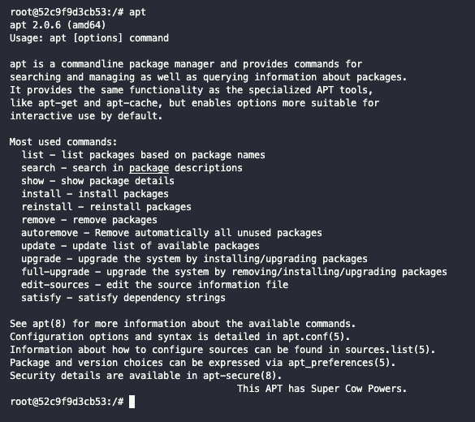
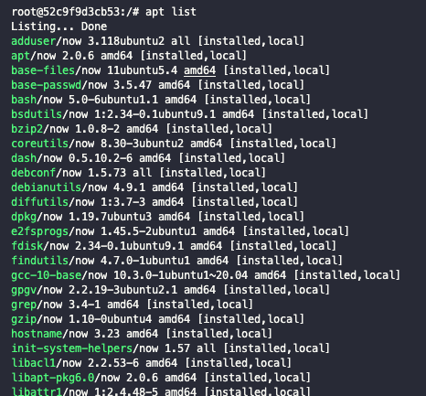
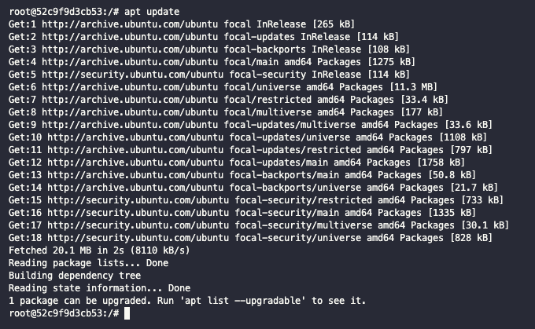
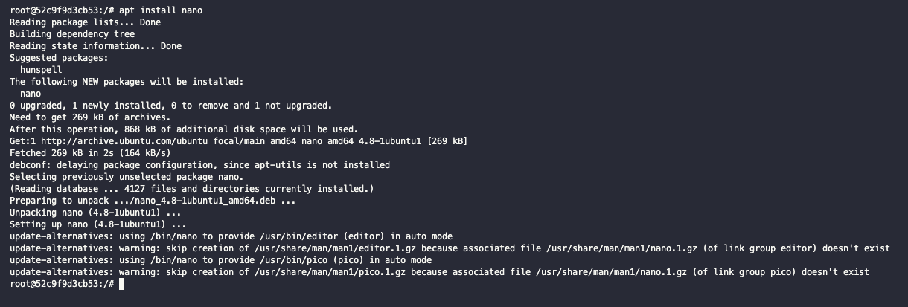
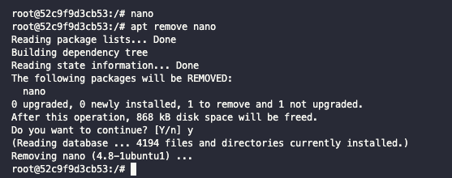

# Linux Command Line

## Linux distributions

Linux is an open-source OS. Therefore, many development communities have built their our custom versions of it. We call them *Linux distributions* or *Linux distros* for short. Some of the most popular are:

- Ubuntu (the one we'll use here)
- Debian
- Alpine
- Fedora
- CentOS

The commands are mostly the same for all of them.

## Running Linux

Head on to [DockerHub](https://hub.docker.com) and search for **ubuntu**.


Click on the image card and DockerHub will redirect you to its page. Here you can find the `docker pull` command to download this image into your computer. In this case that is simply `docker pull ubuntu`.


If instead you run `docker run ubuntu`, docker will first check if the image is locally available. If it is, it will run it. If it is not, it will pull it and then run it.


To check which containers are running we run:

``` shell
docker ps
```


The `ubuntu` image is not being used in any of our containers and is therefore not shown. If we want to display all containers (running or otherwise), we need to add the `-a` flag (which stands for *all*):

``` shell
docker ps -a
```


If we need to start a container in the interactive mode we need to add the `-it` flag, as well as the name of the image to run:

``` shell
docker run -it <image_name>
```


What we have done is to open a shell in the container. This shell is not waiting for our commands. The first part of the prompt says that we are currently logged in as the `root` user. Following that comes the name of the machine. So user `root` is at (`@`) machine ID `52c9f9d3cb53`. After the colon (`:`), the forward slash (`/`) represents where we are in the file system. In this case, we are at the root directory. Lastly, the pound sign (`#`) means that we have the highest levels of privileges. If we had logged in as a regular user we use see a currency sign (`$`).

Some commands that we can use are:

- `echo` to print something to the terminal
- `whoami` will display the user name
- `echo $0` will display the location of the shell program
- `ls` will display all directories
- `history` will display a list of all the commands that we've run
- with `!#` where `#` is a number from the history, we can re-run that command

## Managing packages

In Ubuntu we manage packages with `apt` (*Advances Package Tool*). If we run `apt` in the container, we can get a list of all the sub-commands that we can use



For example, we can use `apt list` to see the list of all available packages and their status.



If we don't see the package that we need in that list, we can run `apt update` and the list will be updated from a predefined list of sources.



To install a package we use.

``` shell
apt install <package_name>
```



Here we are installing `nano` which is a lightweight text editor for Ubuntu. To remove it we run:

``` shell
apt remove nano
```


