# Building images

- [Building images](#building-images)
  - [Images and containers](#images-and-containers)
  - [Dockerfile instructions](#dockerfile-instructions)
  - [Choosing the right base image](#choosing-the-right-base-image)
  - [Copying files into the image](#copying-files-into-the-image)
  - [Excluding files](#excluding-files)
  - [Running commands](#running-commands)
  - [Setting environment variables](#setting-environment-variables)
  - [Exposing ports](#exposing-ports)
  - [Setting the user](#setting-the-user)
  - [Defining entrypoint](#defining-entrypoint)
  - [Speeding up builds](#speeding-up-builds)
  - [Removing images](#removing-images)
  - [Tagging images](#tagging-images)
  - [Sharing images](#sharing-images)
  - [Saving and loading images](#saving-and-loading-images)

## Images and containers

- An **Image** includes everything an application needs to run
- A **Container** provides an isolated environment for running the application

Each container gets its base from the image, but each one has its own write layer.

## Dockerfile instructions

The first step to dockerize an application is to add a `Dockerfile` to it. This file will contain the instructions for building an image. Instructions can be:

- `FROM` for specifying the base image.
- `WORKDIR` for setting the working directory. Once we set it, all subsequent commands will be run from that directory.
- `COPY` and `ADD` for copying files and directories into the container.
- `RUN` for executing operating system commands.
- `ENV` for setting environment variables.
- `EXPOSE` for exposing the application on a given port
- `USER` for specifying the user that should run the application. This should be a user with limited privileges.
- `CMD` and `ENTRYPOINT` for specifying the command that should be executed when we start a container.

## Choosing the right base image

Images can be in any registry. The default that Docker will use is DockerHub, but there are others (like MCR). When not using DockerHub, we need to supply the complete URL for the `FROM` instruction. For each base image (like `node`, `python`, etc) we can have multiple (even hundreds) of different tags that combine versions of our runtime and OS. Choosing the correct one is important- But doing so requires understanding the specifications of the application, requirements, dependencies, etc. and therefore needs to be done on a case by case basis.

Once we are ready to build the image, we run:

``` shell
docker build -t IMAGE_NAME .
```

To check the images that we have, we use:

``` shell
docker images
```

To start a container using the image that we've built, we use:

``` shell
docker run -it IMAGE_NAME
```

If we want to start the container in a different program than the default (for example, start in `bash`) we run:

``` shell
docker run -it IMAGE_NAME bash
```

Or `shell`:

``` shell
docker run -it IMAGE_NAME sh
```

An example `Dockerfile` at this point would look like:

``` Dockerfile
FROM node:14.16.0-alpine3.13
```

## Copying files into the image

Once we have selected a base image, we need to copy the application files into the image. We use the `COPY` command to copy files or directories from the current directory (the directory where the `Dockerfile` is located) into the image. The destination can be a directory in the image. If it doesn't exist, Docker will create it.

We can specify multiple fils and or directories to copy by simply listing them with spaces. Remember that the list is case-sensitive. We can also use patterns to specify the list of files. If we want to copy everything in the current directory into the image, we use a period (`.`).

The destination can be a directory, in which case we need to end it with a forward-slash (so `/app/`, not `/app`). We can use relative directories if the first set the `WORKDIR` command. If the destination is the `WORKDIR`, then we use a period (`.`).

An example `Dockerfile` at this point would look like:

``` Dockerfile
FROM node:14.16.0-alpine3.13
WORKDIR /app
COPY . .
```

If one of our files has a space in its name, then we need to use the array format of the `COPY` command:

``` Dockerfile
FROM node:14.16.0-alpine3.13
WORKDIR /app
COPY ["hello world.txt", "."]
```

Alternatively, we can use the `ADD` command. This command has all the same features of the `COPY` command but:

- we can add files from URLs (`http://.../file.json`)
- if we supply a compressed file, `ADD` will automatically decompress it in the image. (`ADD file.zip`)

The best practice is to use `COPY`. When setting the `WORKDIR` the container will start there if we run it in interactive mode.

## Excluding files

We don't need to build and ship images with all the application dependencies. We can add files that explain how the environment needs to be built, exclude the dependencies and libraries themselves, and then add the command to re-establish the environment.

To ignore files, we use a `.dockerignore` file. Any file or directory that we include in that file will be excluded at build time.

## Running commands

As part of the container build process we can run commands using the `RUN` keyword. For example, we can use this to install dependencies. Docker will download and install all dependencies when building, so that they are available when the image is used in a container.

``` Dockerfile
FROM node:14.16.0-alpine3.13
WORKDIR /app
COPY . .
RUN npm install
```

In each invocation of the `RUN` command we can pass a command. We can have as many invocations as needed.

## Setting environment variables

To set environment variables we use the `ENV` instruction. To it we need to supply `key=value` pairs. The `=` sign can be omitted, but that is no longer considered best practice.

``` Dockerfile
FROM node:14.16.0-alpine3.13
WORKDIR /app
COPY . .
RUN npm install
ENV API_URL=http://api.myapp.com/
```

## Exposing ports

To set the port in which the container will be listing on we use the `EXPOSE` command. To it we pass the port number. But this is the port of the container, not the localhost (on our machine).

``` Dockerfile
FROM node:14.16.0-alpine3.13
WORKDIR /app
COPY . .
RUN npm install
ENV API_URL=http://api.myapp.com/
EXPOSE 3000
```

## Setting the user

By default, Docker will run our application with the `root` user. But this user has too many privileges and can cause security issues in the application. For running the application we need to use a `system` user. This user needs to be created when building the image. And before creating the user, we need to create a group so that we can add the user to that group. We do all of this in one command. The best practice is for this system user and the group to be called `app`.

``` Dockerfile
FROM node:14.16.0-alpine3.13
WORKDIR /app
COPY . .
RUN npm install
ENV API_URL=http://api.myapp.com/
EXPOSE 3000
RUN addgroup app && adduser -S -G app app
```

Now we need to user the `USER` command to run the application using this user.

``` Dockerfile
FROM node:14.16.0-alpine3.13
WORKDIR /app
COPY . .
RUN npm install
ENV API_URL=http://api.myapp.com/
EXPOSE 3000
RUN addgroup app && adduser -S -G app app
USER app
```

## Defining entrypoint

If we try running the application in the container at this point it won't work. The reason is that up until we use `RUN` command, we did everything with the `root` user. The new `app` user does not have permissions to access the `/app` directory in the image.

``` Dockerfile
FROM node:14.16.0-alpine3.13
RUN addgroup app && adduser -S -G app app
USER app
WORKDIR /app
COPY . .
RUN npm install
ENV API_URL=http://api.myapp.com/
EXPOSE 3000
```

Now we can rebuild the image. When done we can start the app by running:

``` shell
docker run IMAGE_NAME npm start
```

But we don't want to have to include `npm start` every time we want to start the application in the container. We can work around this by specifying a command at the end of the `Dockerfile`.

``` Dockerfile
FROM node:14.16.0-alpine3.13
RUN addgroup app && adduser -S -G app app
USER app
WORKDIR /app
COPY . .
RUN npm install
ENV API_URL=http://api.myapp.com/
EXPOSE 3000
CMD npm start
```

Because the `CMD` instruction is to start the app we should not include multiple calls to it in the `Dockerfile`. If we do, only the last one will take effect.

The difference between `RUN` and `CMD` is that `RUN` is a build-time instruction. It will be executed when we run `docker build`. On the other hand, `CMD` is a run-time instruction. It will be executed when we start the container via `docker run`.

The `CMD` command has two forms. The *shell form* takes a command as we would run it on the local shell. The *execute form* takes an array of strings.

``` Dockerfile
# Shell form
CMD npm start

# Execute form
CMD ["npm", "start"]
```

The best practice is to use the execute form, because the shell form will be executed inside a separate shell (`/bin/sh` for Linux, or `cmd` for Windows). Therefore, the cleanup process for the shell form is more expensive.

We also have a similar command called `ENTRYPOINT`. This too can the either a shell or execute form. The difference is that the `CMD` command can be over-written when running `docker run` by simply supplying a different command. To override the `ENTRYPOINT` command we would have to use the `--entrypoint` option. Therefore, it's recommended to use the `ENTRYPOINT` to specifying commands that we always want to run when starting the container, and using `CMD` for adhoc commands.

## Speeding up builds

An image is a collection of layers. A layer is a small file system that only includes modified files. When Docker builds the image he does so by executing the commands line after line, each one generating a new layer. That layer only includes the files that were modified as a result of that instruction. (Technically, some instructions might generate more then one layer. For example, the base image is generally going to consist of more than one layer.)

We can explore the layers with the following command:

``` shell
docker history IMAGE_NAME
```

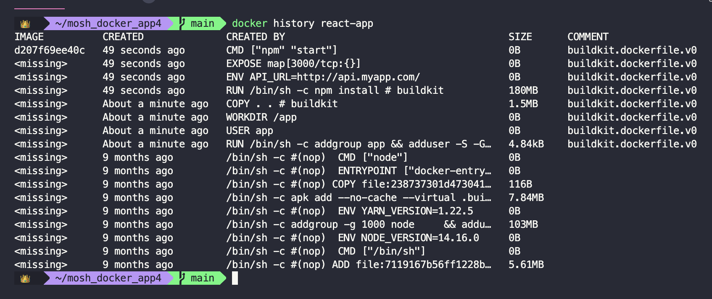

In the `CREATED BY` column you can see the instruction that created the layer. And in the `SIZE` column you can see the size of that layer. This list needs to be read from bottom to top.

We can use caching to speed up our builds. When doing so, Docker will first check if the line that it's about to run was modified. If it was not, then it will not re-execute it, but use the cached one. The problem is that once a layer is re-built, all the subsequent layers need to be rebuilt too. Since the `COPY` instruction needs to come before the `RUN` instructions that install dependencies, every time we change the code base of our application the dependencies need to be installed again. This is generally the bottle neck in the build process.

The solution to this problem is to separate the instructions. First we'll copy all the list of dependencies and install them. Then we'll copy the application code.

``` Dockerfile
FROM node:14.16.0-alpine3.13
RUN addgroup app && adduser -S -G app app
USER app
WORKDIR /app
COPY package*.json .
RUN npm install
COPY . .
ENV API_URL=http://api.myapp.com/
EXPOSE 3000
CMD npm start
```

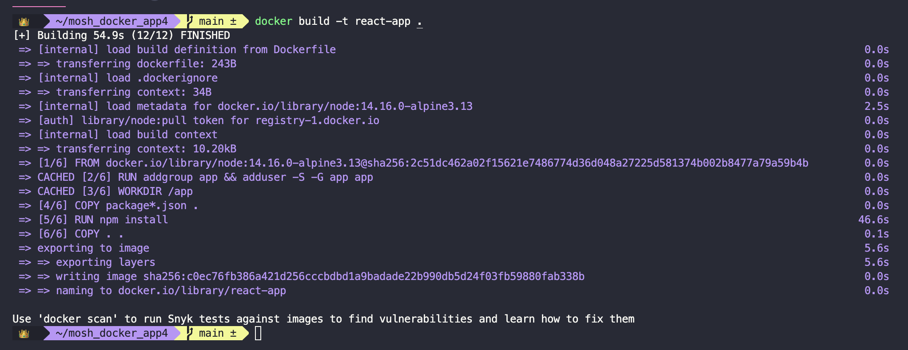

Here you can see that the first build (after modifying the `Dockerfile`) took almost a minute. Now we can do some changes to the code base and re-build.

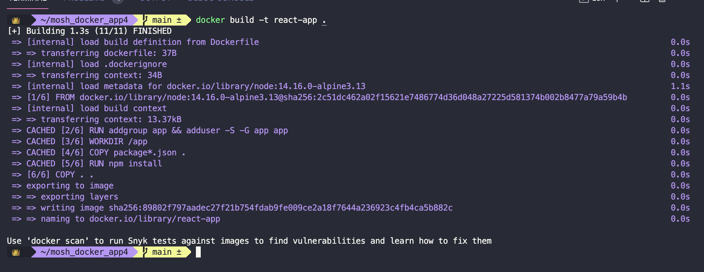

Now our build only took 1.3 seconds!! If you read the output you can see that while on the first build only layers 1, 2, and 3 where cached, on the second one layers 1 to 5 were cached.

The take away is that the order of the instructions matters!! The more stable instructions should be on the top and the more changing ones on the bottom.

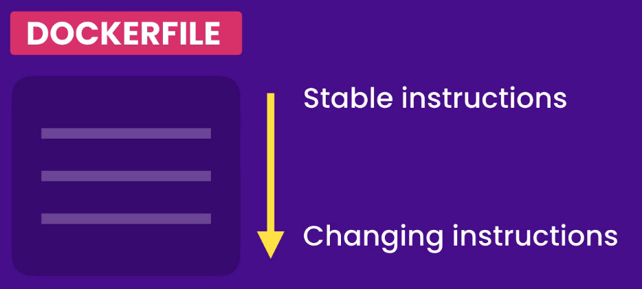

## Removing images

Images that have no name and no tag are called **dangling** images. This are essentially layers that have no relationship with tagged images. To get rid of them we use:

``` shell
docker image prune
```

If the dangling images are not removed, that means that we still have containers running that are using the old images. Beware that running `docker ps` might not show these containers, as they might be in the stopped state. Be sure to run `docker ps -a`. To get rid of stopped containers we run:

``` shell
docker container prune
```

After this, `docker images` will still show us the tagged images. To remove one of these images we run:

``` shell
docker image rm IMAGE_NAME_OR_ID
```

We can pass multiple images separated by a space.

## Tagging images

Whenever we run `docker build` Docker automatically assigns the image tag as `latest`. This is a meaningless tag. It's just a label. It doesn't necessarily mean that it is in fact the latest build. It might be pointing to an older image and cause problems.

We can tag an image at build time by running:

``` shell
docker build -t REPOSITORY_NAME:TAG_NAME .
```

Which tagging convention you use depends on the situation (semantic versioning, code names, etc.).


An image can have multiple tags. To check that we just need to look at the image ID. If the ID is the same, it's the same image. We can remove a tag by running:

``` shell
docker image remove REPOSITORY_NAME:TAG_NAME
```

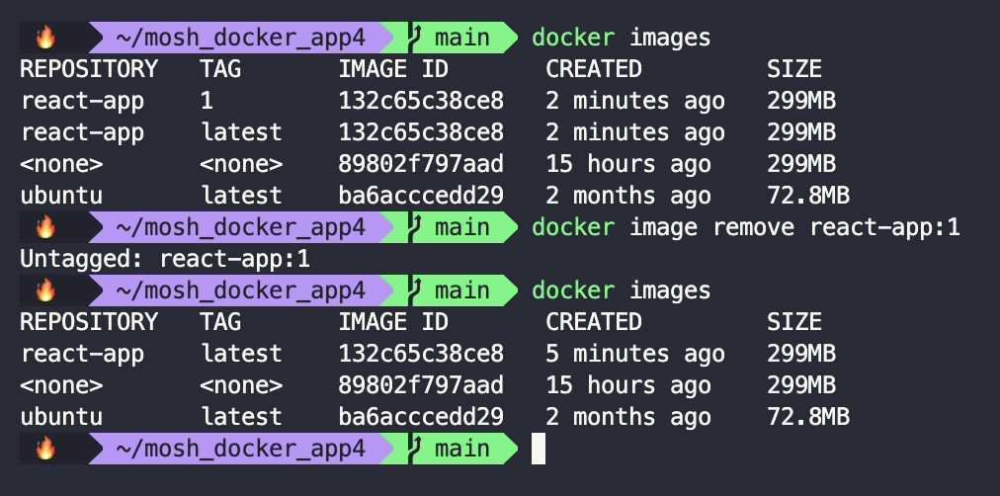

To tag an image after building it we can use:

``` shell
docker image tag REPOSITORY_NAME:CURRENT_TAG REPOSITORY_NAME:NEW_TAG
```

or

``` shell
docker image tag IMAGE_ID REPOSITORY_NAME:NEW_TAG
```

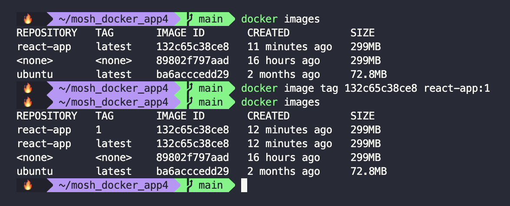

The `latest` tag can get out of sync and we should not use it in production. For example, if we now build version 2 we'll see:

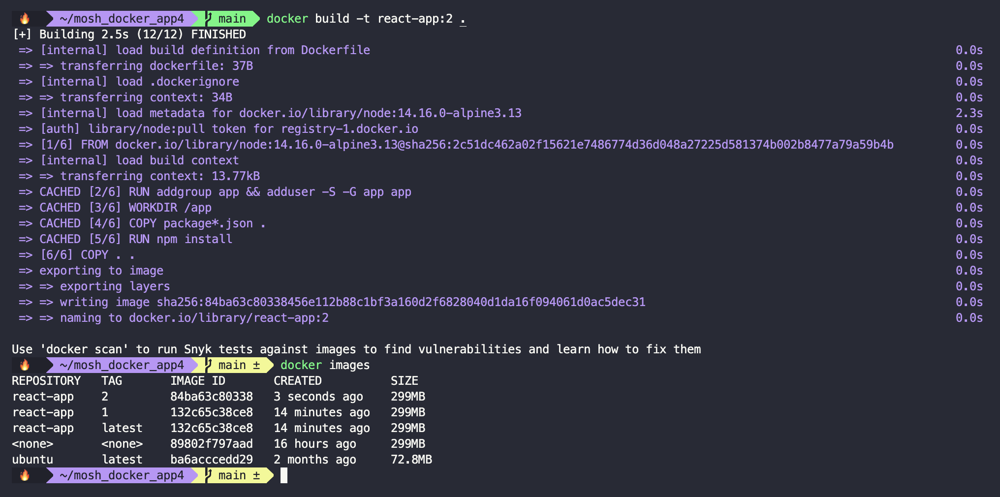

Now the `latest` tag is pointing to version `1`, when the latest build is version `2`. To change the `latest` tag so that it points to the newest version of the image we run:

``` shell
docker image tag IMAGE_ID REPOSITORY_NAME:latest
```

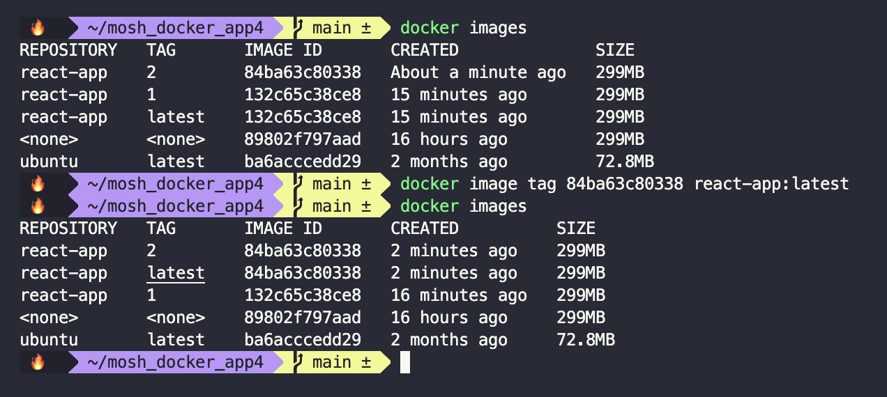

## Sharing images

To share images on DockerHub, first create a repository (just as you would on GitHub). In this repository you can have multiple images with different tags.

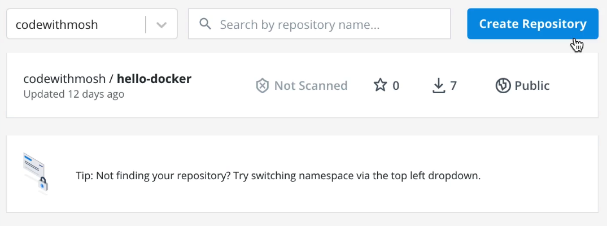

Give it a new and description, and set its visibility.

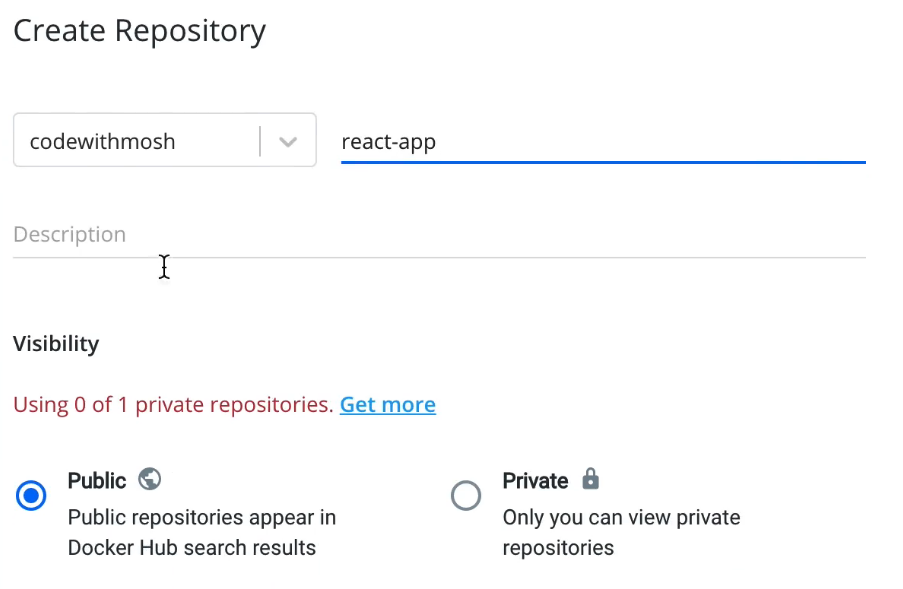

Next we can connect the DockerHub repository to a GitHub repository. If we do that, every time we new code is included in the GitHub repository, DockerHub will pull the code and build a new image.

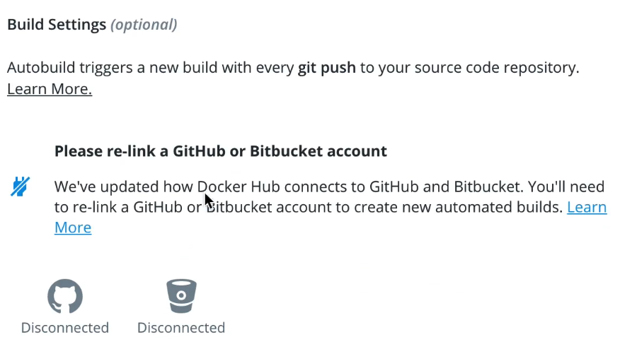

To push the image to the repository, we have to give it that name locally too. To do that we just change the tag:

``` shell
docker image tag IMAGE_ID NEW_TAG
```

Only that now `IMAGE_TAG` will be of the form `DOCKERHUB_USERNAME/REPOSITORY_NAME:TAG_NAME`.

In order to push the image, first we need to login. To do so we run:

``` shell
docker login
```

If you are already logged into Docker Desktop, the CLI will use your credentials from there. Otherwise, it will ask you for them.

To push the image to the repo we just run:

``` shell
docker push IMAGE_TAG
```

where once again `IMAGE_TAG` will be of the form `DOCKERHUB_USERNAME/REPOSITORY_NAME:TAG_NAME`. Docker will push the image one layer at a time. Therefore, changes to dependencies might cause this process to be a little bit slower.

Now that the image is on DockerHub, we can pull it from any other machine by running:

``` shell
docker pull IMAGE_TAG
```

## Saving and loading images

If you have an image on your computer and want to port it to another machine but without using DockerHub, you can save it in a compress filed in your machine, port it, and then load it in the other machine.

To save we run:

``` shell
docker image save -o OUTPUT_FILE IMAGE
```

where `OUTPUT_FILE` is usually a `tar` file. The result will be a `tar` file on your computer. You can unzip it to inspect it. Inside of it there will be folders, each representing a layer. Each layer contains a `json` file and another `tar` file, which itself contains all the files in that layer.

To load the image we use:

``` shell
docker image load -i FILE_NAME
```

where `FILE_NAME` is a `tar` file containing the compressed version of our image.
