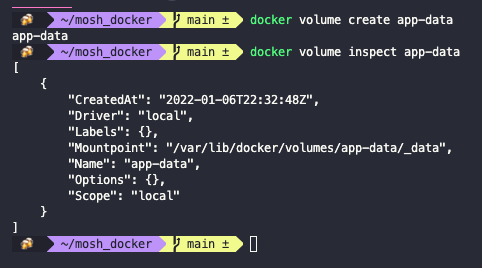
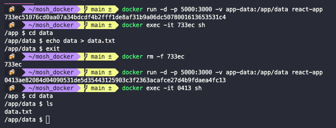

# Working with containers

- [Working with containers](#working-with-containers)
  - [Starting containers](#starting-containers)
  - [Viewing logs](#viewing-logs)
  - [Publishing ports](#publishing-ports)
  - [Executing commands in running containers](#executing-commands-in-running-containers)
  - [Stopping and starting containers](#stopping-and-starting-containers)
  - [Removing containers](#removing-containers)
  - [Containers file system](#containers-file-system)
  - [Persisting data using volumes](#persisting-data-using-volumes)

## Starting containers

To see the running containers (which are just processes) we use:

``` shell
docker ps
```

To run a new container we use:

``` shell
docker run IMAGE
```

To run a container in the detached mode (in the background) we use:

``` shell
docker -d run IMAGE
```


Docker automatically assigns each container a random name. We can give it a name by running:

``` shell
docker run -d --name NAME IMAGE
```


## Viewing logs

To view the logs of a container we use:

``` shell
docker logs CONTAINER_ID
```


This command has some additional options.

- With the `-f` flag we can follow the log. This will allow us to see on the terminal whatever is written to the log.
- With the `-n` flag we can get just the last `n` lines of the log
- With the `-t` flag we can add timestamps to the log entries.

## Publishing ports

To send traffic from the container to the local host we need to publish a port. As you can see above, containers are not published by default (their value is `3000/tcp` because we specified that on the `Dockerfile`). To publish a port we use the `-p` flag to publish a port in on the host to a port in the container.

``` shell
docker run -d -p LOCAL_PORT:CONTAINER_PORT --name NAME IMAGE
```


## Executing commands in running containers

When we start a container it executes the default command that we specify in the `Dockerfile`. If we need to run commands on a running container we use:

``` shell
docker exec CONTAINER_NAME_OR_ID <command>
```

Commands need to be of the same OS as the base image (Linux commands for when using a Linux distro, Windows for when using Windows, and so on). This commands will be run in the default directory, which we specified in the `Dockerfile` with the `WORKDIR` instruction.

If we want to start a shell session in the container we run:

``` shell
docker exec -it CONTAINER_NAME_OR_ID sh
```

When we are done we can run the `exit` command, and that won't affect the state of the container.


## Stopping and starting containers

We can stop a running container with

``` shell
docker stop CONTAINER_NAME_OR_ID
```


To re start it we use

``` shell
docker start CONTAINER_NAME_OR_ID
```


## Removing containers

There are two ways of removing a container:

``` shell
docker container remove CONTAINER_NAME_OR_ID
```

or

``` shell
docker rm CONTAINER_NAME_OR_ID
```

If the container is still running, we have two options. Stop the container and then remove it, or to use the `--force` option:

``` shell
docker rm -f CONTAINER_NAME_OR_ID
```

If we have many container but only want to search for one, we can use the pipe (in Linux):

``` shell
docker ps -a | grep CONTAINER_NAME
```

If we want to get rid of all stopped containers in one go, we run:

``` shell
docker container prune
```

## Containers file system

Each container has its own file system, which is invisible to other containers.


If we delete the container, the file system will be deleted with it and we will loose any extra data (for example, data generated during an interactive shell session). So we should never store data in the containers file system. To do that we use volumes.

## Persisting data using volumes

A volume is a storage outside of the container. It can be in the local host or in the cloud.

To create a volume we use the `create` command:

``` shell
docker volume create VOLUME_NAME
```

To inspect the volume we use the `inspect` command:

``` shell
docker volume inspect VOLUME_NAME
```



This example volume has `"Driver": "local"` because we are using local storage. If you want to create them in the cloud, you need to do some research in that cloud service for *how to create Docker volumes*. The `Mountpoint` key contains as its value the location of the volume. In the case of MacOS, the path is inside the virtual machine.

Now that we have a volume we can start a container and give it this volume for persistent data.

``` shell
docker run -d -p LOCAL_PORT:CONTAINER_PORT -v VOLUME_NAME:/CONTAINER/ABSOLUTE/PATH IMAGE
```

We do not need to create the volume before running the container. If the volume doesn't exist, Docker will create it when we run the `docker run` command. The same holds true for the directory in the container. But if the directory does not exist, we might run into issues with permissions (since the directory will be created by the `root` user). To solve this, we are going to add the creation of the directory in the `Dockerfile`.

``` dockerfile
FROM node:14.16.0-alpine3.13
RUN addgroup app && adduser -S -G app app
USER app
WORKDIR /app
RUN mkdir data
COPY package*.json .
RUN npm install
COPY . .
ENV API_URL=http://api.myapp.com/
EXPOSE 3000
CMD npm start
```

Now we can start a container, create a file in it, remove the container, start another container, and the file will still be there. This is because the volume is stored on the local host and not inside the container.



We can also share the same volume between different containers.
